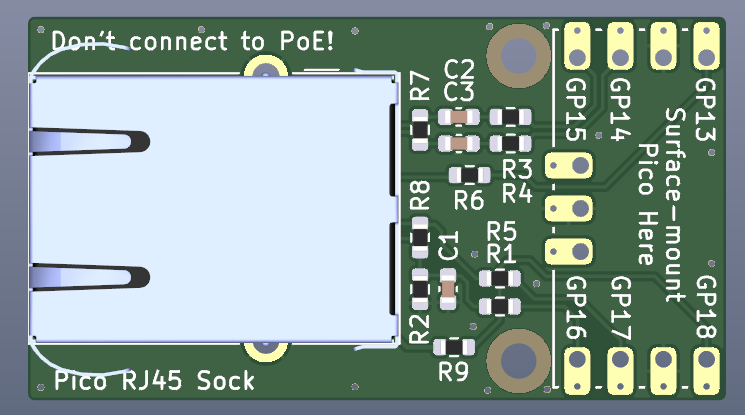
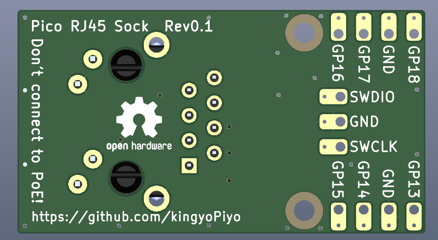
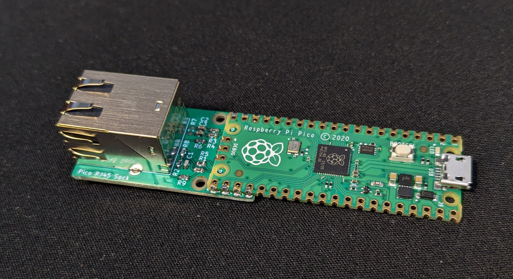

# Pico-RJ45-Sock

RJ45 connector for Raspberry Pi Pico.  
10BASE-T communication using Raspberry Pi Pico's PIO and software stack.  
See also : [Pico-10BASE-T](https://github.com/kingyoPiyo/Pico-10BASE-T "Pico-10BASE-T")

## Board Layout
  
  

## Assembly
  

## Schematic
[pico_rj45.pdf](kicad/pico_rj45.pdf "Schematic")

## Sample Firmware
| Link | Description |
| ---- | ---- |
| [Hello World](firmware/hello_world/ "hello_world") | ARP, UDP, ICMP Test.<br>Change *system.h* for connection settings.|
| [VBAN](firmware/vban/ "vban") | ARP, UDP, ICMP & VBAN Audio Streaming from ADC0, ADC1.<br>Change *system.h* for connection settings.|

## Quick-start

### pico-sdk install
See also : https://github.com/raspberrypi/pico-sdk
```
sudo apt install cmake gcc-arm-none-eabi libnewlib-arm-none-eabi libstdc++-arm-none-eabi-newlib build-essential
git clone https://github.com/raspberrypi/pico-sdk
cd pico-sdk
git submodule update --init
```
### Hello world Compile
```
git clone https://github.com/kingyopiyo/Pico-RJ45-Sock
cd Pico-RJ45-Sock/firmware/hello_world
mkdir build
cd build
cmake ..
make
```

## Reference
* Pico DVI Sock https://github.com/Wren6991/Pico-DVI-Sock
* pico_eth https://github.com/holysnippet/pico_eth_doc
